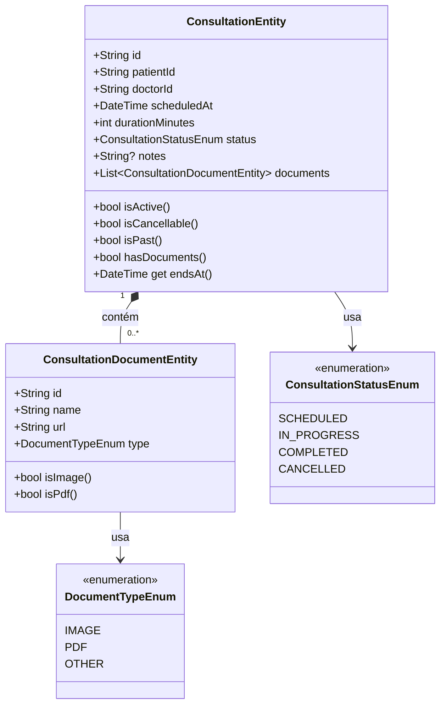

# Template: Diagrama de Entidade (Class Diagram)

> Mostra **as Entities, seus campos e métodos de regra**.
> Os métodos são as regras intrínsecas — tudo que depende só dos dados do próprio objeto.

---

## Quando usar

- Para definir o que entra em cada `Entity` antes de codar
- Para identificar relações entre Entities (1..*, 0..1, etc.)
- Para separar regras intrínsecas (Entity) das de fluxo (UseCase)

## Dicas de preenchimento

- **Campos** = o que a Entity armazena (sem lógica)
- **Getters/métodos** = as regras intrínsecas (retornam bool, double, etc.)
- **Relação `*--`** = composição (Entity pai contém Entity filha)
- **Relação `o--`** = agregação (Entity referencia outra)
- NUNCA coloque `copyWith()` nem `fromJson/toJson` — essas não pertencem à Entity
- Collections devem ser `List<X>` unmodifiable — documente isso nos comentários

## Formato de saída

````markdown
## Diagrama de Entidade — [FeatureName]

```mermaid
classDiagram
  class [EntityName]Entity {
    +String id
    +String [campo1]
    +[Tipo] [campo2]
    +DateTime [campoData]
    +[RelatedEnum] [campoStatus]
    +List~[RelatedEntity]~ [campoLista]

    +bool is[Estado]()
    +bool has[Campo]()
    +double total[Valor]()
    +bool exceeds[Limite]()
  }

  class [RelatedEntity]Entity {
    +String id
    +String [campo1]
    +double [campoNumerico]

    +bool is[Valido]()
  }

  class [RelatedEnum] {
    <<enumeration>>
    [VALOR_A]
    [VALOR_B]
    [VALOR_C]
  }

  [EntityName]Entity "1" *-- "0..*" [RelatedEntity]Entity : contém
  [EntityName]Entity --> [RelatedEnum] : usa
```

### Regras intrínsecas (getters/métodos)

| Getter / Método | Retorno | Regra |
|-----------------|---------|-------|
| `is[Estado]` | `bool` | [condição — ex: status == active] |
| `has[Campo]` | `bool` | [condição — ex: lista.isNotEmpty] |
| `total[Valor]` | `double` | [cálculo — ex: sum dos itens] |
| `exceeds[Limite]` | `bool` | [comparação — ex: total > maxValue] |
````

## Exemplo preenchido (feature: consultation)

````markdown
## Diagrama de Entidade — Consultation



### Regras intrínsecas (getters/métodos)

| Getter / Método | Retorno | Regra |
|-----------------|---------|-------|
| `isActive` | `bool` | `status == scheduled \|\| status == in_progress` |
| `isCancellable` | `bool` | `isActive && !isPast` |
| `isPast` | `bool` | `scheduledAt.isBefore(DateTime.now())` |
| `hasDocuments` | `bool` | `documents.isNotEmpty` |
| `endsAt` | `DateTime` | `scheduledAt.add(Duration(minutes: durationMinutes))` |
````
