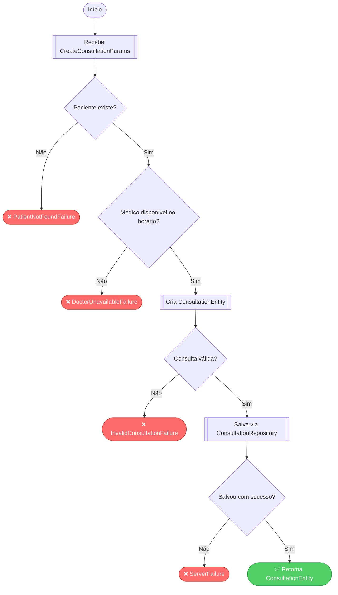

# Template: Diagrama de Fluxo (Flowchart)

> Mostra **decisões e validações** dentro de cada UseCase.
> Cada losango (`{...}`) é uma regra de negócio que você precisará implementar.

---

## Quando usar

- Ao detalhar a lógica interna de um UseCase específico
- Para identificar todos os `Failure` possíveis de um fluxo
- Para validar que a lógica de negócio está completa antes de codar

## Dicas de preenchimento

- **Retângulo** `[...]` = ação/processo (chamar repositório, transformar dado)
- **Losango** `{...}` = decisão/validação (regra de negócio — vira `if` ou `Either`)
- **Cor vermelha** `:::error` = caminho de Failure (erro)
- **Cor verde** `:::success` = caminho de sucesso
- Cada losango é um potencial `Left(XxxFailure())` no código

## Formato de saída

````markdown
## Diagrama de Fluxo — [UseCaseName]

```mermaid
flowchart TD
  classDef error fill:#ff6b6b,color:#fff,stroke:#c0392b
  classDef success fill:#51cf66,color:#fff,stroke:#2f9e44
  classDef process fill:#74c0fc,color:#000,stroke:#339af0

  A([Início]) --> B[[Recebe Params]]
  B --> C{[Validação 1]?}

  C -- Não --> D([❌ [XxxFailure]]):::error
  C -- Sim --> E[[Chama [Repository]]]

  E --> F{[Validação 2]?}
  F -- Não --> G([❌ [YyyFailure]]):::error
  F -- Sim --> H[[Aplica regra de negócio]]

  H --> I{[Validação 3]?}
  I -- Não --> J([❌ [ZzzFailure]]):::error
  I -- Sim --> K([✅ Retorna [Entity]]):::success
```

### Decisões mapeadas (losangos)

| Decisão | Failure (caminho Não) | Onde implementar |
|---------|-----------------------|-----------------|
| [Validação 1] | `[XxxFailure]` | `[Entity]Entity.is[Valid]` ou `[Action]UseCase` |
| [Validação 2] | `[YyyFailure]` | `[Entity]Entity.has[Campo]` ou `[Action]UseCase` |
| [Validação 3] | `[ZzzFailure]` | `[Action]UseCase` |
````

## Exemplo preenchido (feature: consultation → CreateConsultationUseCase)

````markdown
## Diagrama de Fluxo — CreateConsultationUseCase



### Decisões mapeadas (losangos)

| Decisão | Failure (caminho Não) | Onde implementar |
|---------|-----------------------|-----------------|
| Paciente existe? | `PatientNotFoundFailure` | `PatientRepository.getById` → UseCase |
| Médico disponível? | `DoctorUnavailableFailure` | `DoctorRepository.checkAvailability` → UseCase |
| Consulta válida? | `InvalidConsultationFailure` | `ConsultationEntity.isValid` |
| Salvou com sucesso? | `ServerFailure` | `ConsultationRepository.create` → try/catch |
````
