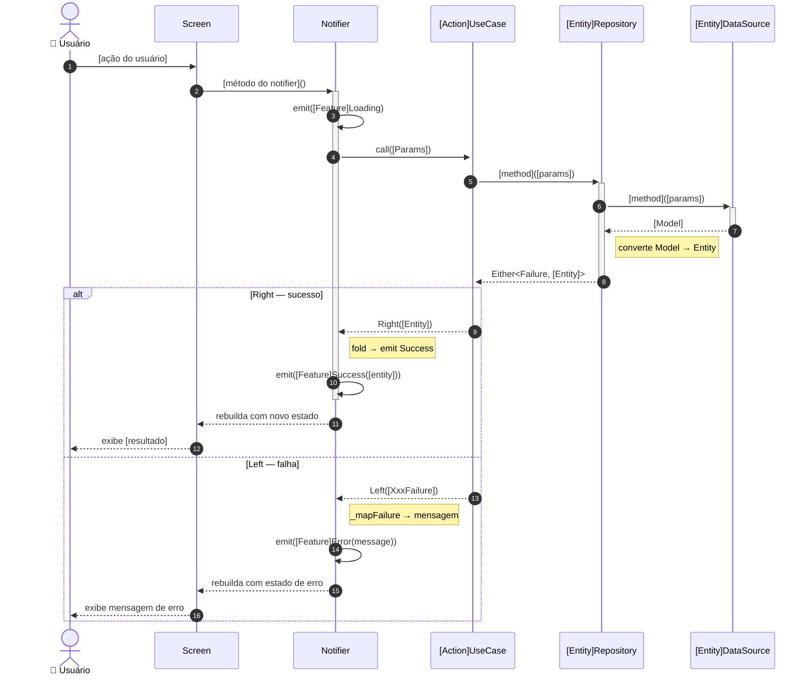
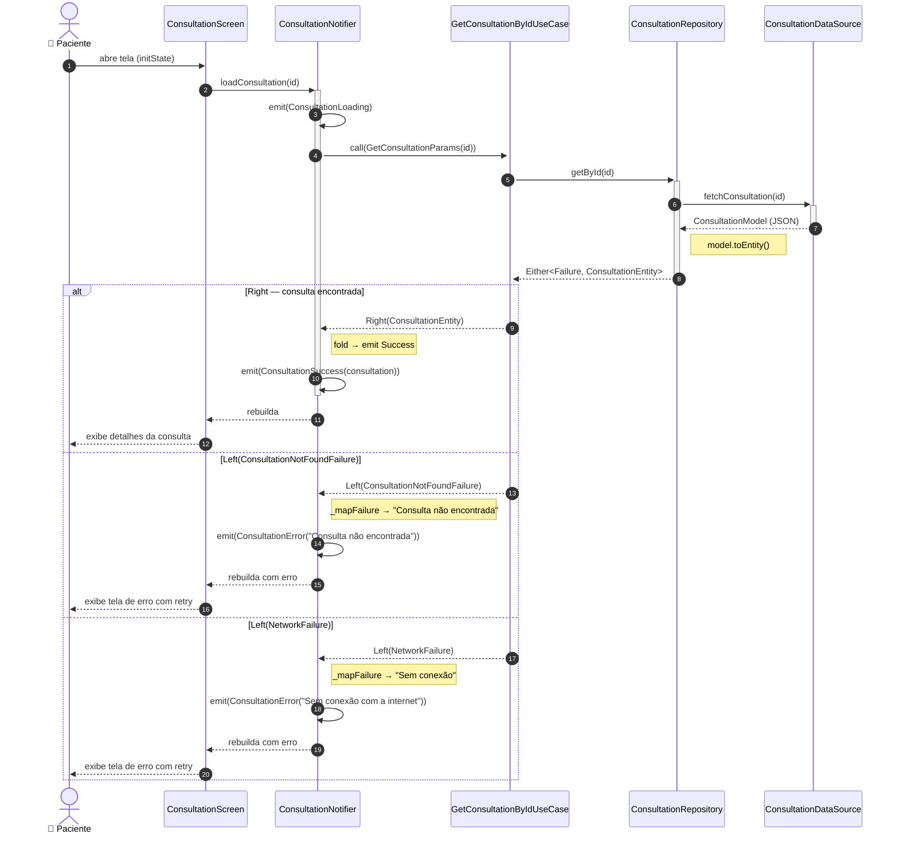

# Template: Diagrama de Sequência

> Mostra **a ordem das chamadas entre camadas**.
> Valida que a regra de dependência da Clean Architecture está sendo respeitada.

---

## Quando usar

- Para validar o fluxo completo de um UseCase antes de codar
- Para identificar quem chama quem (e detectar violações de arquitetura)
- Para documentar o caminho feliz E os caminhos de erro

## Dicas de preenchimento

- **Participantes** = as camadas: UI, Notifier, UseCase, Repository, DataSource
- **`->>` síncrono** = chamada direta (sem `await`)
- **`-->>` resposta** = retorno (pontilhado)
- **`->>+` ativa** = inicia processamento (caixa de ativação)
- **`->>-` desativa** = conclui processamento
- **`alt/else`** = caminhos alternativos (Right vs Left do Either)
- **`Note`** = anotações sobre regras ou conversões importantes

## Regra de dependência (validar no diagrama)

```
UI → Notifier → UseCase → Repository (contrato) → RepositoryImpl → DataSource
```

Se o diagrama mostrar UI chamando DataSource diretamente = violação arquitetural.

## Formato de saída

````markdown
## Diagrama de Sequência — [UseCaseName]



### Notas arquiteturais

| Ponto | Observação |
|-------|-----------|
| Model → Entity | Acontece no Repository (`model.toEntity()`) — NUNCA no UseCase ou UI |
| Failure → message | Acontece no Notifier (`_mapFailure`) — NUNCA no UseCase |
| Either | Morre no Notifier — State recebe dado já resolvido |
| `ref.watch` vs `ref.read` | UI usa `watch` no build, `read` em callbacks |
````

## Exemplo preenchido (feature: consultation → GetConsultationByIdUseCase)

````markdown
## Diagrama de Sequência — GetConsultationByIdUseCase



### Notas arquiteturais

| Ponto | Observação |
|-------|-----------|
| Model → Entity | `ConsultationModel.toEntity()` no `ConsultationRepositoryImpl` |
| Failure → message | `_mapFailure` no `ConsultationNotifier` |
| Either | Morre no `fold` do Notifier — `ConsultationSuccess` recebe `ConsultationEntity` puro |
| Múltiplos Left | Cada `Failure` tem mensagem diferente mapeada no `_mapFailure` |
````
