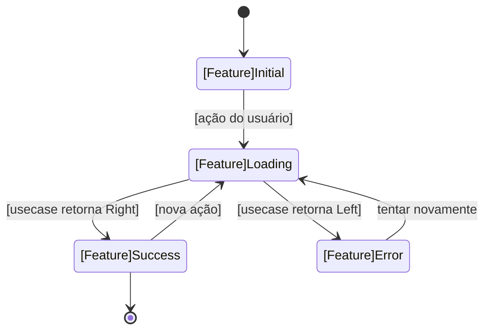
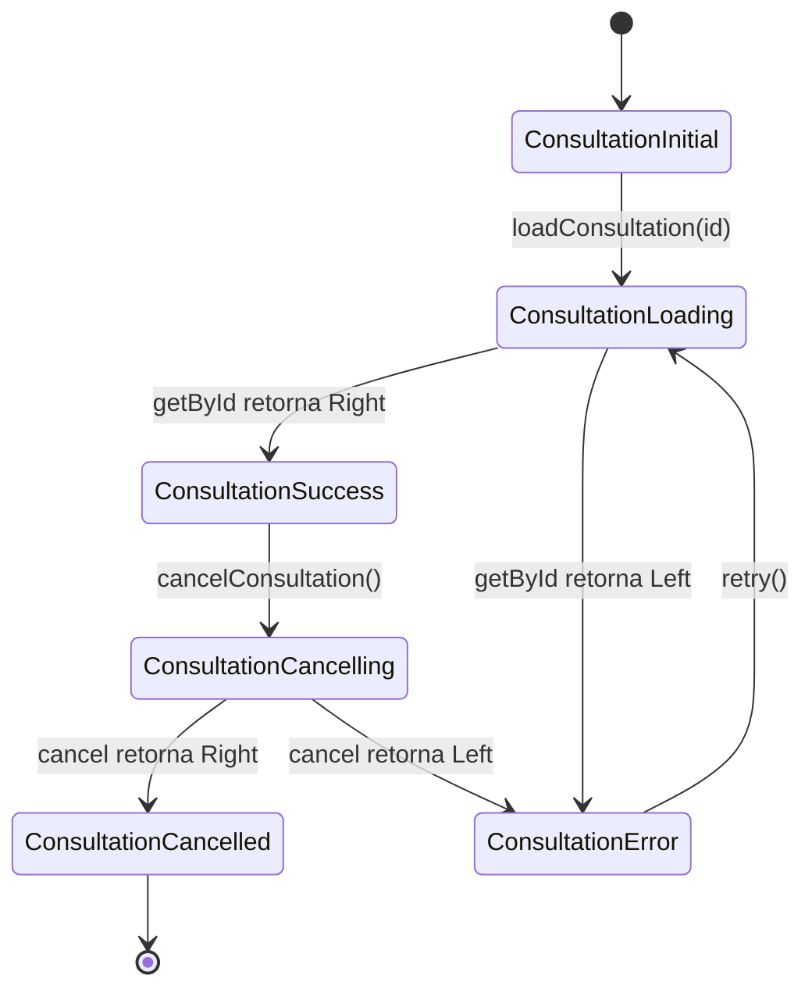

# Template: Diagrama de Estados

> Mostra **as transições de estado** de uma tela ou fluxo.
> Cada estado vira um `case` na `sealed class` dos States do Riverpod.

---

## Quando usar

- Para definir os States antes de criar o arquivo `*_state.dart`
- Para garantir que todos os caminhos (sucesso, erro, loading) estão mapeados
- Para identificar ações que disparam transições

## Dicas de preenchimento

- **Estado** = um caso da sealed class (Initial, Loading, Success, Error)
- **Transição** `-->` = uma ação do usuário ou resultado de operação async
- **Rótulo na transição** = o que dispara a mudança (método do Notifier)
- O estado `[*]` representa início e fim do fluxo
- Estados com dados: `Success(entity)`, `Error(message)`

## Regra dos States (Riverpod / Clyvo)

```dart
// Cada estado = uma subclasse da sealed class
sealed class [Feature]State extends Equatable {
  @override
  List<Object?> get props => [hashCode]; // base usa hashCode
}

final class [Feature]Initial extends [Feature]State {}
final class [Feature]Loading extends [Feature]State {}
final class [Feature]Success extends [Feature]State {
  final [Entity] [entity]; // dados já resolvidos — NUNCA Either
}
final class [Feature]Error extends [Feature]State {
  final String message; // string para UI — convertido no Notifier
}
```

## Formato de saída

````markdown
## Diagrama de Estados — [FeatureName]



### Estados mapeados

| Estado | Classe | Dados |
|--------|--------|-------|
| Initial | `[Feature]Initial` | — |
| Loading | `[Feature]Loading` | — |
| Success | `[Feature]Success` | `[entity: EntityType]` |
| Error | `[Feature]Error` | `[message: String]` |

### Transições (métodos do Notifier)

| Transição | Método no Notifier | Dispara |
|-----------|-------------------|---------|
| [ação do usuário] | `[methodName]()` | UI: botão / lifecycle |
| [nova ação] | `[methodName]()` | UI: outra interação |
| tentar novamente | `retry()` | UI: botão de retry |
````

## Exemplo preenchido (feature: consultation)

````markdown
## Diagrama de Estados — Consultation



### Estados mapeados

| Estado | Classe | Dados |
|--------|--------|-------|
| Initial | `ConsultationInitial` | — |
| Loading | `ConsultationLoading` | — |
| Success | `ConsultationSuccess` | `consultation: ConsultationEntity` |
| Cancelling | `ConsultationCancelling` | `consultation: ConsultationEntity` |
| Cancelled | `ConsultationCancelled` | — |
| Error | `ConsultationError` | `message: String` |

### Transições (métodos do Notifier)

| Transição | Método no Notifier | Dispara |
|-----------|-------------------|---------|
| Carregar consulta | `loadConsultation(String id)` | Lifecycle: initState |
| Cancelar consulta | `cancelConsultation()` | UI: botão cancelar |
| Tentar novamente | `retry()` | UI: botão retry na tela de erro |
````
