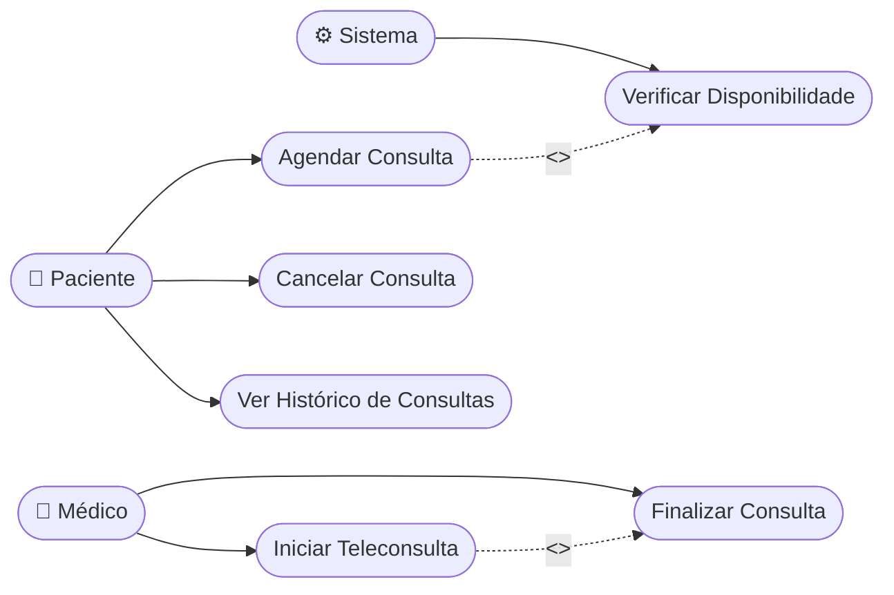

# Template: Diagrama de Casos de Uso

> Mostra **o que o sistema faz** do ponto de vista dos atores.
> Cada `(Caso de Uso)` vira um `UseCase` na Clean Architecture.

---

## Quando usar

- No início do mapeamento de uma feature
- Para identificar quantos e quais UseCases serão necessários
- Para alinhar com stakeholders o escopo da feature

## Dicas de preenchimento

- **Ator** = quem inicia a ação (Paciente, Médico, Sistema, Admin)
- **Caso de uso** = um verbo no infinitivo + substantivo (Agendar Consulta, Cancelar Consulta)
- **<<include>>** = o caso de uso SEMPRE executa o outro (obrigatório)
- **<<extend>>** = o caso de uso OPCIONALMENTE executa o outro (condicional)
- Um caso de uso = um arquivo `UseCase` em `domain/usecases/`

## Formato de saída

````markdown
## Diagrama de Casos de Uso — [FeatureName]

```mermaid
graph LR
  %% Atores
  actorA([👤 [Ator A]])
  actorB([👤 [Ator B]])
  system([⚙️ Sistema])

  %% Casos de uso do Ator A
  uc1([Caso de Uso 1])
  uc2([Caso de Uso 2])
  uc3([Caso de Uso 3])

  %% Casos de uso do Ator B
  uc4([Caso de Uso 4])

  %% Casos de uso do Sistema (automáticos)
  uc5([Caso de Uso Automático])

  %% Relações ator → caso de uso
  actorA --> uc1
  actorA --> uc2
  actorA --> uc3
  actorB --> uc4
  system --> uc5

  %% Relações entre casos de uso
  uc1 -.->|<<include>>| uc5
  uc2 -.->|<<extend>>| uc3
```

### UseCases mapeados

| Caso de Uso | Arquivo | Ator |
|-------------|---------|------|
| Caso de Uso 1 | `[action]_[entity]_use_case.dart` | [Ator A] |
| Caso de Uso 2 | `[action]_[entity]_use_case.dart` | [Ator A] |
| Caso de Uso 3 | `[action]_[entity]_use_case.dart` | [Ator A] |
| Caso de Uso 4 | `[action]_[entity]_use_case.dart` | [Ator B] |
````

## Exemplo preenchido (feature: consultation)

````markdown
## Diagrama de Casos de Uso — Consultation



### UseCases mapeados

| Caso de Uso | Arquivo | Ator |
|-------------|---------|------|
| Agendar Consulta | `create_consultation_use_case.dart` | Paciente |
| Cancelar Consulta | `cancel_consultation_use_case.dart` | Paciente |
| Ver Histórico | `get_consultations_use_case.dart` | Paciente |
| Iniciar Teleconsulta | `start_teleconsultation_use_case.dart` | Médico |
| Finalizar Consulta | `finish_consultation_use_case.dart` | Médico |
| Verificar Disponibilidade | `check_availability_use_case.dart` | Sistema |
````
